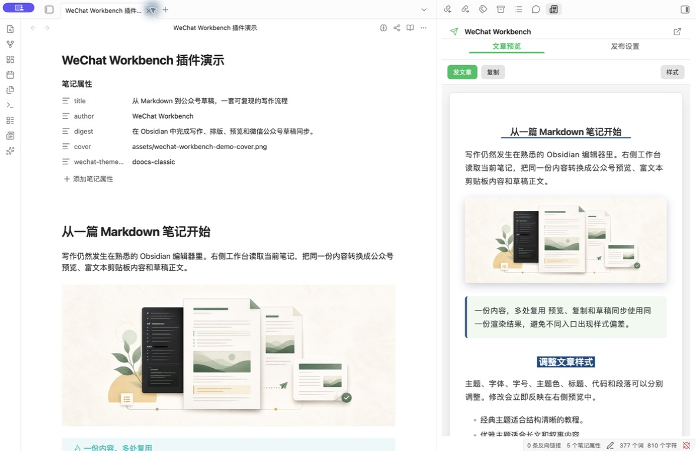
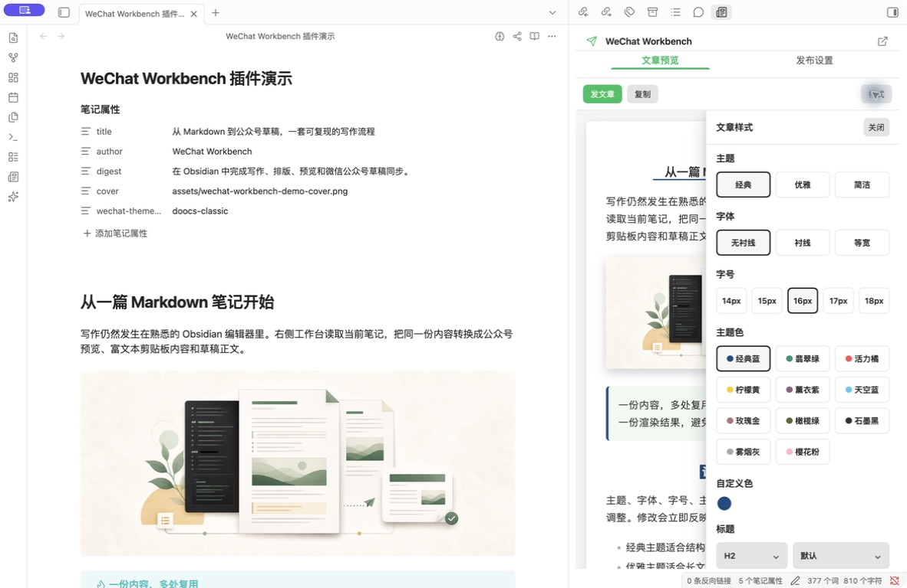
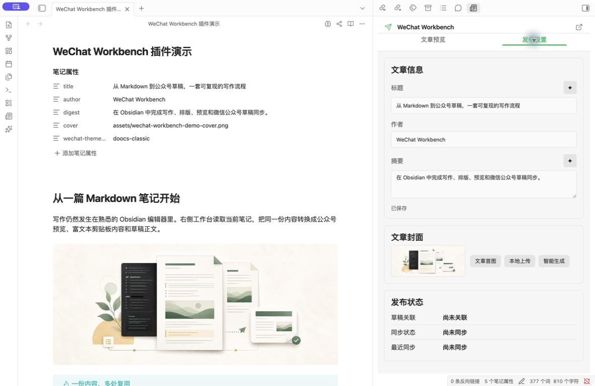

# WeChat Workbench

在 Obsidian 中完成微信公众号文章的写作、排版、预览、复制和草稿同步。

WeChat Workbench 是一款仅支持桌面端的 Obsidian 社区插件。正文继续使用熟悉的 Markdown 编辑器，右侧工作台负责实时预览、样式调整、文章信息、封面和微信公众号草稿同步。

插件只创建或更新微信公众号草稿，不执行正式发布、群发或删除草稿。

## 功能

- 实时预览当前 Markdown 笔记，编辑后自动刷新。
- 提供 7 套内置文章主题和经过安全校验的 Vault 自定义主题。
- 提供 Doocs 风格的组合式样式工作台，可独立调整字体、字号、主题色、标题、代码、图注和段落。
- 支持 GFM 表格、Callout、代码高亮、KaTeX、Mermaid 和本地图片。
- 一键复制微信公众号编辑器可识别的富文本，同时保留纯文本回退内容。
- 支持文章首图、本地图片和可选的 AI 生成封面，封面统一处理为微信公众号常用比例。
- 支持 AI 生成三个标题候选和一个摘要候选，采用后才写入文章信息。
- 本机直连微信公众号 API，支持创建草稿、更新已关联草稿、内容无变化时跳过以及结果不明确时的安全恢复。
- AppSecret、Access Token 和 AI 服务 API Key 只保存到 Obsidian `SecretStorage`。

## 界面预览

### Markdown 编辑与公众号预览



### 文章样式



### 文章信息、封面与草稿状态



## 产品边界

- 仅支持 Obsidian 桌面端，最低版本为 `1.11.4`。
- 当前界面只支持一个微信公众号账号。
- 作者不提供云端中转服务，不收集遥测和分析数据，不展示广告。
- 被动预览在本地完成，不会自动请求远程图片。
- AI 功能默认不启用，只有用户配置服务并主动点击生成时才会联网。
- 微信公众号草稿同步需要对应接口权限，并要求当前公网出口 IP 已加入公众号后台白名单。

## 安装

### Obsidian 社区插件

插件通过社区审核后，可在 Obsidian 中打开“设置 → 第三方插件 → 浏览”，搜索 `WeChat Workbench` 并安装。

### GitHub Release

从对应版本的 GitHub Release 下载以下文件。

```text
main.js
manifest.json
styles.css
```

将它们放入 Vault 的插件目录。

```text
<VAULT>/.obsidian/plugins/wechat-workbench/
```

重新加载 Obsidian，在“设置 → 第三方插件”中启用 `WeChat Workbench`。

### 从源码构建

源码构建需要 Node.js `22.13` 或更高版本。

```bash
npm ci
npm test
npm run build
```

开发和真实账号测试应使用独立测试 Vault。详细步骤见[入门指南](docs/user-guide/getting-started.md)。

## 快速上手

1. 打开一篇 Markdown 笔记。
2. 点击左侧 Ribbon 的报纸图标，或从命令面板运行 `Open workbench`。
3. 在“样式”中选择主题并调整字体、颜色和标题样式。
4. 点击“复制”，将富文本粘贴到微信公众号编辑器。
5. 如需同步草稿，在插件设置或工作台账号入口填写 AppID，并把 AppSecret 保存到 `SecretStorage`。
6. 在“发布设置”中填写文章信息、选择封面，随后点击“发文章”确认草稿同步。

“发文章”只创建或更新微信公众号后台草稿，不会正式群发。

## AI 功能

AI 功能可选。当前设置提供 Agnes 和 DeepSeek 文本服务配置，以及 Agnes 图片服务配置。用户需要自行提供相应服务的 API Key，并承担第三方服务可能产生的费用。

- 获取模型列表时，插件向所选服务发送 API Key，不发送文章内容。
- 生成标题或摘要时，插件发送当前标题、摘要、文章标题层级和经过清理的正文摘录。
- 生成封面时，插件发送模型、用户选择包含的标题和摘要、封面风格模板以及补充视觉要求。
- 每次请求均由用户主动操作触发。插件不会在后台自动生成内容。

更完整的数据说明见[隐私说明](PRIVACY.md)。

## 联网说明

| 用户操作 | 联网目标 | 用途 |
| --- | --- | --- |
| 连接微信公众号账号 | `api.weixin.qq.com` | 获取 Access Token |
| 复制并处理远程图片 | 文章引用的 HTTPS 图片地址 | 读取并校验图片 |
| 同步微信公众号草稿 | `api.weixin.qq.com` | 上传正文图片和封面，创建、读取或更新草稿 |
| 获取 AI 模型列表 | 用户选择的 AI 服务 | 获取可用模型 |
| 生成标题、摘要或封面 | 用户选择的 AI 服务 | 执行用户主动发起的生成请求 |
| 下载 AI 生成结果 | 服务返回的 HTTPS 图片地址 | 读取并校验生成图片 |

远程图片请求会限制协议、重定向次数、超时、响应大小和真实文件类型，并阻止回环地址、私网地址及链路本地地址。

## 文章 Frontmatter

插件读取常见文章信息字段，并使用独立的 `wechat-*` 字段保存草稿关联状态。写入时会保留其他未知字段。

```yaml
---
title: 文章标题
author: 作者名称
digest: 文章摘要
cover: .wechat-workbench/covers/example/cover.png
content_source_url: https://example.com/source
wechat-theme-id: native
---
```

## 常见问题

### 无法连接微信公众号

检查 AppID、AppSecret、公众号接口权限和 [IP 白名单](docs/user-guide/wechat-ip-whitelist.md)。切换网络后，公网出口 IP 可能发生变化。

### 草稿同步结果不明确

不要连续点击创建草稿。先查看[草稿恢复说明](docs/user-guide/recovery.md)，再到微信公众号后台核对最近草稿。

### 远程图片无法处理

确认图片使用公开 HTTPS 地址，响应内容确实是受支持的图片，并且没有跳转到本机或私网地址。

### AI 生成失败

检查所选服务的 Base URL、模型、API Key、余额、限流状态和网络连接。插件不会把已保存的 API Key 回填到输入框。

## 文档

- [入门与本地安装](docs/user-guide/getting-started.md)
- [主题和自定义样式](docs/user-guide/themes.md)
- [文章封面](docs/user-guide/covers.md)
- [草稿恢复](docs/user-guide/recovery.md)
- [微信公众号 IP 白名单](docs/user-guide/wechat-ip-whitelist.md)
- [隐私说明](PRIVACY.md)
- [安全策略](SECURITY.md)
- [第三方许可证](THIRD_PARTY_NOTICES.md)

## 问题反馈

普通功能问题和建议请使用 [GitHub Issues](https://github.com/anightmonarch/obsidian-wechat-workbench/issues)。安全漏洞请按[安全策略](SECURITY.md)私下报告，不要在公开 Issue 中提交凭据、未公开文章或漏洞利用细节。

## 许可证

本项目采用 [MIT License](LICENSE)。第三方资源的许可证见 [THIRD_PARTY_NOTICES.md](THIRD_PARTY_NOTICES.md)。
