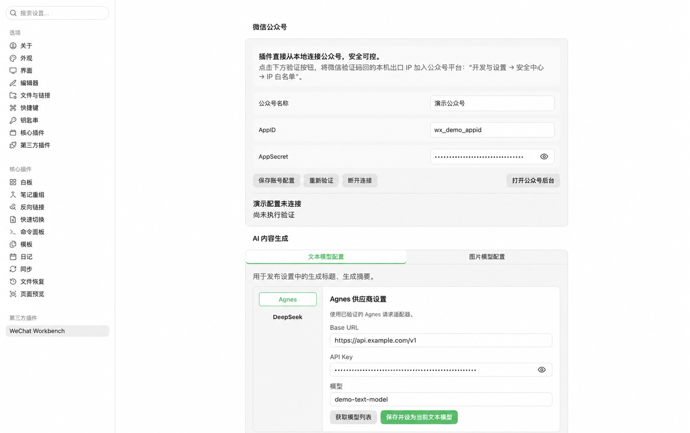

# WeChat Workbench

English | [简体中文](README.zh-CN.md)

Write, style, preview, copy, and sync WeChat Official Account drafts without leaving Obsidian.

WeChat Workbench is a desktop-only Obsidian community plugin. You keep writing in the Markdown editor while a dedicated workbench provides live preview, composable styles, article metadata, cover management, and draft synchronization.

The plugin only creates or updates drafts. It does not publish, broadcast, or delete WeChat content.

## Features

- Live preview of the active Markdown note with automatic refresh after edits.
- Seven built-in article themes plus security-validated custom themes stored in the Vault.
- A Doocs-inspired composable style workbench for fonts, sizes, colors, headings, code blocks, captions, and paragraphs.
- GFM tables, callouts, syntax highlighting, KaTeX, Mermaid, and local images.
- One-click rich-text copy for the WeChat editor with a plain-text fallback.
- Cover selection from the article's first image, a local upload, or an optional AI-generated image.
- Optional AI generation of three title candidates and one digest candidate. Nothing is saved until you adopt a candidate.
- Automatic upload of local article images to WeChat during draft synchronization, with the final HTML referencing WeChat CDN URLs.
- Direct local access to the WeChat Official Account API for draft creation, linked-draft updates, unchanged-content skipping, and safe recovery from ambiguous results.
- AppSecret, Access Token, and AI provider API keys stored only in Obsidian `SecretStorage`.

### No separate image host required

When you explicitly synchronize a draft, the plugin reads local article images, uploads them through the WeChat Official Account image API, and replaces local paths with the returned HTTPS CDN URLs. The submitted HTML therefore depends on neither local file paths nor a separate object-storage service or third-party image host.

Image uploads are part of the user-confirmed draft synchronization flow. Passive preview never uploads article images.

## Screenshots

### Markdown editing and WeChat preview


### Article styles


### Article metadata, cover, and draft status


### Plugin settings



## Scope and limitations

- Desktop only. Minimum supported Obsidian version: `1.11.4`.
- The current interface supports one WeChat Official Account. The UI and user guides are primarily in Simplified Chinese.
- No author-operated relay service, telemetry, analytics, or advertising.
- Passive preview is local and does not automatically fetch remote images.
- AI features are disabled until you configure a provider and explicitly request generation.
- Draft synchronization requires the relevant WeChat API permissions and a public egress IP added to the account's IP allowlist.

## Installation

### Obsidian Community Plugins

After the plugin is accepted into the community directory, open **Settings → Community plugins → Browse**, search for `WeChat Workbench`, and install it.

### GitHub Release

Download these files from the matching [GitHub Release](https://github.com/anightmonarch/obsidian-wechat-workbench/releases):

```text
main.js
manifest.json
styles.css
```

Place them in the plugin directory of your Vault:

```text
<VAULT>/.obsidian/plugins/wechat-workbench/
```

Reload Obsidian, then enable `WeChat Workbench` under **Settings → Community plugins**.

### Build from source

Building from source requires Node.js `22.13` or later.

```bash
npm ci
npm test
npm run build
```

Use a separate test Vault for development and live-account testing. See the [getting started guide](docs/user-guide/getting-started.md) for details.

## Quick start

1. Open a Markdown note.
2. Select the newspaper icon in the left ribbon, or run `Open workbench` from the command palette.
3. Open **Styles** to choose a theme and adjust typography, colors, and heading styles.
4. Select **Copy** and paste the generated rich text into the WeChat editor.
5. To synchronize drafts, enter the AppID in plugin settings or the workbench account entry, then save the AppSecret to `SecretStorage`.
6. Complete the article metadata and cover under **Publish settings**, then confirm the draft synchronization action.

The synchronization action only creates or updates a draft in the WeChat backend. It never broadcasts the article.

## AI features

AI support is optional. The current settings support Agnes and DeepSeek for text generation and Agnes for image generation. You provide the provider API keys and are responsible for any third-party charges.

- Fetching a model list sends the API key to the selected provider but does not send article content.
- Generating titles or a digest sends the current title, digest, heading hierarchy, and a sanitized body excerpt.
- Generating a cover sends the selected model, any title or digest fields you chose to include, the cover-style template, and your supplemental visual instructions.
- Every request requires an explicit user action. The plugin does not generate content in the background.

See the [privacy policy](PRIVACY.md) for the complete data-handling description.

## Network access

| User action | Destination | Purpose |
| --- | --- | --- |
| Connect a WeChat account | `api.weixin.qq.com` | Obtain an Access Token |
| Copy and process remote images | HTTPS image URLs referenced by the article | Fetch and validate images |
| Synchronize a WeChat draft | `api.weixin.qq.com` | Upload body images and covers; create, read, or update drafts |
| Fetch AI models | User-selected AI provider | Retrieve available models |
| Generate titles, a digest, or a cover | User-selected AI provider | Complete the explicitly requested generation task |
| Download an AI-generated image | HTTPS URL returned by the provider | Fetch and validate the generated image |

Remote-image requests restrict protocols, redirects, timeouts, response sizes, and detected file types. Loopback, private, and link-local destinations are blocked.

## Article frontmatter

The plugin reads common article metadata and stores draft associations in dedicated `wechat-*` fields. Unknown fields are preserved when frontmatter is updated.

```yaml
---
title: Article title
author: Author name
digest: Article digest
cover: .wechat-workbench/covers/example/cover.png
content_source_url: https://example.com/source
wechat-theme-id: native
---
```

## Troubleshooting

### The plugin cannot connect to WeChat

Check the AppID, AppSecret, account API permissions, and [IP allowlist](docs/user-guide/wechat-ip-whitelist.md). Your public egress IP may change when you switch networks.

### The result of draft synchronization is ambiguous

Do not repeatedly create another draft. Read the [recovery guide](docs/user-guide/recovery.md), then check recent drafts in the WeChat backend.

### A remote image cannot be processed

Confirm that the image uses a public HTTPS URL, returns a supported image type, and does not redirect to a local or private address.

### AI generation fails

Check the selected provider's Base URL, model, API key, balance, rate limits, and network connectivity. Saved API keys are never copied back into input fields.

## Documentation

The current user guides are written in Simplified Chinese.

- [Getting started and local installation](docs/user-guide/getting-started.md)
- [Themes and custom styles](docs/user-guide/themes.md)
- [Article covers](docs/user-guide/covers.md)
- [Draft recovery](docs/user-guide/recovery.md)
- [WeChat Official Account IP allowlist](docs/user-guide/wechat-ip-whitelist.md)
- [Privacy policy](PRIVACY.md)
- [Security policy](SECURITY.md)
- [Third-party notices](THIRD_PARTY_NOTICES.md)

## Support

Use [GitHub Issues](https://github.com/anightmonarch/obsidian-wechat-workbench/issues) for normal bug reports and feature requests. Report security vulnerabilities privately as described in the [security policy](SECURITY.md). Never include credentials, unpublished articles, or exploit details in a public issue.

## License

Released under the [MIT License](LICENSE). See [THIRD_PARTY_NOTICES.md](THIRD_PARTY_NOTICES.md) for third-party licenses.
