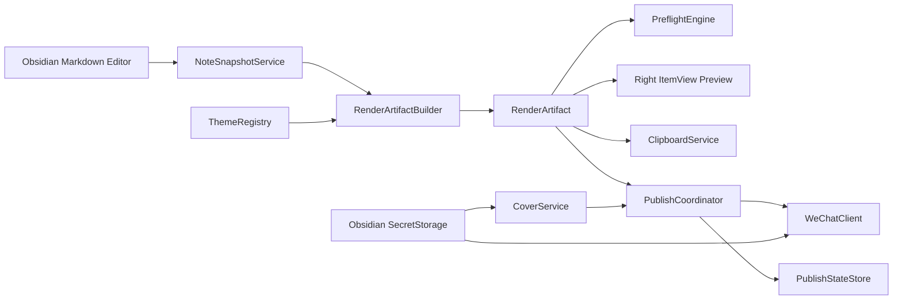
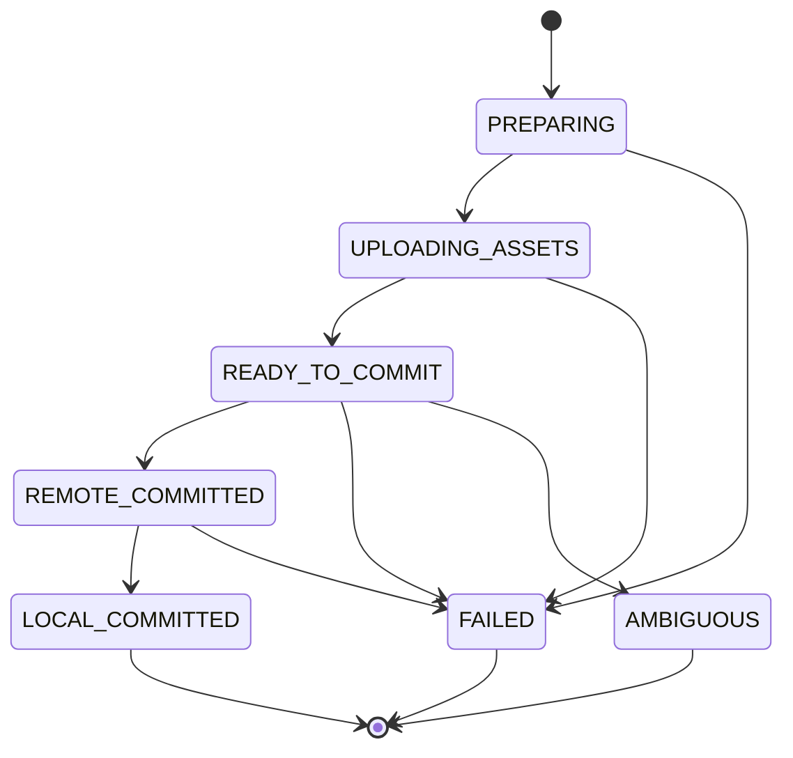

# WeChat Workbench 正式设计

- 状态：待用户书面审阅
- 日期：2026-08-18
- GitHub 仓库：`obsidian-wechat-workbench`
- 插件显示名：`WeChat Workbench`
- 插件 ID：`wechat-workbench`
- 产品形态：Obsidian 桌面端社区插件
- 许可证：MIT；所有实现采用 clean-room 方式，不复制 AGPL 参考项目源码

## 1. 结论

WeChat Workbench 不应再做一个“Markdown 转公众号 HTML”的普通插件。该基础能力已经高度同质化。产品应定位为：

> Obsidian 中可验证、可复现的微信公众号发布工作台。

首版围绕一条核心承诺设计：同一篇笔记经过同一主题和同一渲染器后，预览、复制到公众号、同步到草稿箱必须共享同一份规范化渲染产物，并在发布前给出可操作的预检结果。

产品不维护作者云服务。用户在本机配置公众号凭据和可选图片生成服务，插件直接调用微信公众平台及用户指定的图片生成 API。插件只创建或更新草稿，不执行群发或正式发布。

## 2. 调研结论

### 2.1 参考项目 WeSight

参考仓库：[reference-project/wesight-obsidian](https://github.com/reference-project/wesight-obsidian)

其中 “WeChat Official Account drafts” 模块提供了以下可借鉴的产品形态：

- Obsidian 中央 Markdown 编辑器与右侧公众号预览并排工作。
- 预览随当前活动笔记实时更新。
- 工具栏集中提供主题切换、复制和发布动作。
- 模板主题与 AI 主题被抽象为可切换的渲染配置。
- 发布前显示连接状态和检查结果。

但不能直接抽取该模块：

- 公众号发布依赖 `api.wesight.ai`、WeSight 登录和积分体系，服务端实现不在仓库内。
- AI 主题、封面生成和发布流程与 WeSight 平台强耦合。
- 关键视图文件混合 UI、渲染、资源处理、网络和状态，职责过重。
- 源码使用 AGPL-3.0-or-later；非 AGPL 产品不得复制或改写其受保护实现。

因此，本项目只借鉴经过公开观察得到的交互模式和产品问题，不复制源码、CSS、主题或非公开协议。

### 2.2 已存在的同类插件

调研过的代表项目包括：

| 项目 | 已覆盖能力 | 本项目不能只重复的部分 |
| --- | --- | --- |
| [WeChat Publisher](https://github.com/reference-project/wechat-publisher) | 实时预览、复制、图片处理、草稿同步 | 通用 Markdown 转换与发布 |
| [WeChatPB](https://github.com/reference-project/obsidian-wechat-publisher) | 多账号、内置/自定义主题、SecretStorage、代理、历史 | 主题数量和多账号不是首版差异化 |
| [MP Publisher](https://github.com/reference-project/obsidian-mp-publisher) | 主题管理、实时预览、复制、创建/更新草稿 | 普通主题管理和 API 发布 |
| [Wechat Converter](https://github.com/reference-project/obsidian-wechat-converter) | 预览、复制、微信/飞书/多平台同步 | 首版不做多平台扩张 |
| [WeChat Article Composer](https://github.com/reference-project/wechat-article-obsidian) | 预览、封面与正文配图、草稿创建 | 单纯加入 AI 配图不足以形成壁垒 |

结论：内置主题、自定义 CSS、实时预览、复制 HTML、图片上传、草稿同步都属于市场基础能力。WeChat Workbench 的产品价值必须来自确定性产物、发布预检、草稿关联更新和可恢复发布事务。

### 2.3 Obsidian 官方约束

- 使用 `ItemView` 注册自定义视图，并默认放在右侧工作区，是官方支持的插件形态。
- 插件必须允许用户移动、缩放、关闭和恢复视图，不能模拟或替换 Obsidian 整个窗口。
- 全局配置进入 `PluginSettingTab`；当前文章的主题、封面和发布状态进入右侧视图。
- 插件外壳使用 Obsidian CSS 变量与组件语义，文章预览样式独立隔离。
- 需要正确处理 Deferred Views，不能假设视图同步实例化。
- `SecretStorage` 从 Obsidian 1.11.4 起可用，因此最低版本固定为 1.11.4。
- `manifest.json` 的 ID 不得包含 `obsidian`；显示名也不得包含 Obsidian 或 Plugin。

官方依据：

- [Views](https://docs.obsidian.md/Plugins/User+interface/Views)
- [Manifest](https://docs.obsidian.md/Reference/Manifest)
- [SecretStorage](https://docs.obsidian.md/Reference/TypeScript+API/SecretStorage)
- [Submit your plugin](https://docs.obsidian.md/Plugins/Releasing/Submit+your+plugin)
- [Developer policies](https://docs.obsidian.md/Developer+policies)

### 2.4 微信 API 现实约束

- 微信官方将 Access Token 和草稿接口描述为服务端调用能力，要求保护 AppSecret，并通过 IP 白名单限制调用来源。
- 本项目没有作者云端，因此调用发生在用户自己的 Obsidian 桌面进程中；AppSecret 和缓存 Access Token 留在用户本机。
- 用户公网出口 IP 必须加入公众号后台白名单。动态 IP、企业代理、VPN、运营商网络变化都会导致调用失败。
- 插件必须提供“查看当前出口 IP、白名单配置、常见错误定位”的指南，但不得鼓励将白名单配置为任意地址。
- 发布动作只把内容送入草稿箱，用户仍需到微信公众平台审核并正式发布。

本地直连是用户明确接受的产品约束。它消除了作者托管成本，但不能消除凭据驻留桌面端、IP 变化和微信接口策略调整带来的风险。

## 3. 用户与场景

### 3.1 目标用户

- 长期使用 Obsidian 写公众号文章的个人创作者或小团队成员。
- 拥有公众号开发接口权限，能够取得 AppID/AppSecret 并配置 IP 白名单。
- 希望在 Obsidian 内完成排版、检查、复制或草稿同步，但仍在微信后台做最终审核。
- 重视可复现结果和失败可定位性，不希望内容经过插件作者的服务器。

### 3.2 核心任务

1. 在 Obsidian 中编辑 Markdown，右侧实时看到公众号排版。
2. 切换内置主题或加载 Vault 自定义主题。
3. 在复制或同步前看到缺失元数据、图片、HTML 兼容性等问题。
4. 一键复制富文本到微信编辑器，或查看 HTML 源码。
5. 选择本地图片、正文首图、默认图或 AI 生成图作为封面。
6. 首次创建草稿；后续修改同一笔记时更新原草稿。
7. 在失败、超时或本地写入异常后知道远端是否可能已发生变化，以及下一步如何恢复。

## 4. 首版范围

### 4.1 必须交付

- Obsidian 桌面端右侧 `ItemView`。
- 跟随当前活动 Markdown 笔记的本地实时预览。
- 4 套 clean-room 内置主题：原生简洁、苍绿、书刊、技术文档。
- Vault 目录中的自定义主题包，支持重新加载、校验和错误定位。
- 统一 `RenderArtifact`，服务预览、复制和发布。
- 发布前预检，区分阻断项与警告项。
- “复制到公众号”：同时写入剪贴板 `text/html` 和 `text/plain`。
- “复制 HTML 源码”：放入更多菜单，用于排查和导出。
- 单公众号账号 UI。
- 本地 AppID/AppSecret 配置、Access Token 获取与缓存。
- 当前出口 IP 展示和公众号后台白名单教程。
- 正文图片上传与复用、封面素材上传与复用。
- 草稿首次创建、关联更新、内容无变化跳过。
- 发布报告、错误阶段、微信 `errcode`、`errmsg`、`rid` 和安全重试建议。
- 可插拔封面生成接口，首个适配器为 OpenAI 兼容图片 API，支持自定义 Base URL 和模型。
- macOS、Windows、Linux 桌面端支持；移动端明确不可用。

### 4.2 明确不做

- 不维护作者云端、中转 API、账号系统、积分或订阅系统。
- 不执行公众号正式发布、群发或自动审核通过。
- 不做多公众号 UI、批量发布或跨账号草稿管理。
- 不做 AI 写作、自动改稿、热点抓取或完整内容生产流水线。
- 不做可视化 CSS 主题编辑器。
- 不做 WeSight AI Skill 主题系统。
- 不做移动端发布。
- 不做飞书、小红书、知乎等多平台发布。
- 不在首版加入遥测、广告或云同步。

## 5. 交互设计

### 5.1 Obsidian 中的布局

插件只拥有右侧面板，Obsidian 文件树、编辑器、标签栏和状态栏仍由 Obsidian 管理。

```text
┌──────────────┬──────────────────────────┬─────────────────────────┐
│ Obsidian     │ 当前 Markdown 编辑器      │ WeChat Workbench        │
│ 文件树       │                          │                         │
│              │ 用户在这里写作            │ 预览 | 文章设置          │
│              │                          │                         │
│              │                          │ 发布到草稿箱  复制到公众号│
│              │                          │ 主题            更多    │
│              │                          │                         │
│              │                          │ 预检状态                │
│              │                          │ 微信文章预览            │
└──────────────┴──────────────────────────┴─────────────────────────┘
```

首次打开时默认使用右侧 leaf。再次打开复用已有视图并聚焦，不重复创建。用户可以拖到左侧或主工作区，也可以缩放和关闭。工作区恢复后重新绑定当前活动笔记。

### 5.2 面板结构

顶部：

- 产品名 `WeChat Workbench`。
- 本地账号状态：未配置、可用、Token 失效、IP 未授权、权限不足。
- 设置按钮，进入 Obsidian 全局设置页。

标签页：

- `预览`：工具栏、预检条、文章预览、当前同步状态。
- `文章设置`：标题、作者、摘要、原文链接、封面、主题和草稿关联信息。

主工具栏：

- `发布到草稿箱`：打开确认弹窗并执行同步事务。
- `复制到公众号`：生成可粘贴富文本并写入剪贴板。
- `主题`：选择内置或自定义主题，显示主题版本与校验状态。
- `更多`：复制 HTML 源码、重新运行检查、加载远程图片、查看发布报告、解除草稿关联。

“发布到草稿箱”不得写成“发文章”，避免用户误认为已对外发布。

### 5.3 实时预览

- 只跟随当前活动 Markdown 文件。
- 内容变化后采用 400ms 防抖，读取不可变笔记快照并本地重建产物。
- 切换笔记、主题、文章设置或本地图片后立即触发重建。
- 被动预览不请求远程图片；远程图片显示占位符与“显式加载”动作。
- 预览区域独立滚动；工具栏和检查结果保持可见。
- 笔记不是 Markdown、没有活动文件或渲染失败时显示明确空状态，不抛出全局错误。

### 5.4 全局设置与文章设置

全局设置进入 Obsidian 设置页：

- AppID、AppSecret 录入和清除。
- 测试连接、显示出口 IP、打开白名单指南。
- 默认主题、自定义主题目录。
- 默认作者、默认原文链接、默认封面策略。
- 图片生成 Base URL、模型和 API Key。
- 清除 Token、资源缓存、发布报告与全部凭据。

文章设置进入右侧面板：

- 标题、作者、摘要、原文链接。
- 当前主题。
- 封面来源与裁剪预览。
- 当前草稿关联、最近同步时间、是否存在未同步修改。

## 6. 系统架构



### 6.1 `NoteSnapshotService`

职责：

- 读取当前文件内容、路径、修改时间和 Frontmatter。
- 合并全局默认值与文章级字段。
- 解析本地附件引用，但不执行网络请求。
- 返回不可变 `NoteSnapshot`。

不得直接渲染 HTML、修改 Frontmatter 或调用微信 API。

### 6.2 `ThemeRegistry`

职责：

- 注册 4 套内置主题。
- 扫描用户配置的 Vault 主题目录；默认目录为 `.wechat-workbench/themes/`。
- 校验主题 manifest、CSS 安全规则、作用域和版本。
- 监听 Vault 中主题文件变化并使缓存失效。
- 提供稳定的主题 ID、版本、内容哈希和预览信息。

不得修改文章、发起网络请求或持久化凭据。

### 6.3 `RenderArtifactBuilder`

职责：

- Markdown 解析与受支持扩展转换。
- 构建规范化逻辑 DOM。
- 应用主题并把允许的 CSS 内联到文章节点。
- 清洗 HTML、规范化属性顺序和空白。
- 生成资源槽位、纯文本和诊断信息。
- 在清洗后计算内容哈希。

同一输入、主题内容和渲染器版本必须生成相同规范化逻辑 HTML。微信返回的 CDN URL 不参与逻辑 HTML 的确定性要求。

### 6.4 `PreflightEngine`

职责：

- 对同一个 `RenderArtifact` 执行结构、元数据、资源、微信兼容性和发布状态检查。
- 输出稳定检查代码，而不是只返回自然语言。
- 区分 `BLOCKING`、`WARNING`、`INFO`。
- 为每项问题提供定位和建议动作。

### 6.5 `ClipboardService`

职责：

- 把已经解析资源的产物投影为 `text/html`。
- 同时提供无样式 `text/plain` 降级内容。
- 写入系统剪贴板并验证写入结果。
- 单独支持复制 HTML 源码。

复制正文不要求配置公众号账号。无账号时，本地图片转换为受大小约束的 Data URL 写入剪贴板；该路径必须通过真实微信编辑器验收。有账号时，用户可以选择先上传微信并使用 CDN URL，获得更稳定的跨设备结果。无法安全放入剪贴板的图片必须在复制前明确阻断，不能静默丢失。

### 6.6 `WeChatClient`

职责：

- 获取和刷新 stable Access Token。
- 上传正文图片。
- 上传或复用封面永久素材。
- 创建、读取、更新和查询草稿。
- 统一解析微信错误与 `rid`。

该模块不决定创建还是更新，也不写 Frontmatter。

### 6.7 `CoverService`

职责：

- 按文章设置选择封面来源。
- 支持本地图片、正文首图、全局默认图、AI 生成图。
- 使用统一 `CoverGenerator` 接口接入图片生成服务。
- 首个适配器支持 OpenAI 兼容图片 API、自定义 Base URL 和模型。
- 生成 2.35:1 候选图，保存到 Vault，并要求用户确认后才进入发布。

AI 生成失败不得阻断用户选择本地封面。

### 6.8 `PublishStateStore`

职责：

- 读取和安全合并文章草稿关联字段。
- 维护最多 20 条本地发布报告摘要。
- 在远端提交后先记录恢复回执，再写文章 Frontmatter。
- 支持远端成功、本地写入失败后的恢复。

### 6.9 `PublishCoordinator`

职责：

- 执行单次发布事务和状态转换。
- 保证同一笔记同一账号只有一个活动发布任务。
- 冻结用户确认的产物。
- 决定创建、更新、跳过或进入恢复流程。

该模块是编排器，不实现 Markdown、CSS 或 HTTP 细节。

## 7. 渲染产物

逻辑模型：

```ts
interface RenderArtifact {
  artifactVersion: string;
  rendererVersion: string;
  source: {
    vaultPath: string;
    modifiedAt: number;
    sourceHash: string;
  };
  theme: {
    id: string;
    version: string;
    contentHash: string;
  };
  metadata: ArticleMetadata;
  canonicalHtml: string;
  plainText: string;
  assets: AssetSlot[];
  diagnostics: Diagnostic[];
  contentHash: string;
}
```

`canonicalHtml` 中的图片使用稳定资源槽位。不同消费者只允许替换资源地址：

- 预览：本地图片使用受控 Object URL，远程图片默认占位。
- 复制：无账号时把本地图片解析为受控 Data URL；用户选择微信资源模式时解析为微信 HTTPS URL。失败资源不得静默变成占位。
- 草稿：全部正文资源必须解析为微信 HTTPS URL。

标签结构、文字、顺序和内联样式必须保持一致。这样“预览 = 复制 = 草稿”是视觉与结构承诺，不虚假声称不同网络 URL 的 HTML 字节完全相同。

## 8. Markdown 与 HTML 支持

首版支持：

- 标题、段落、粗体、斜体、删除线、链接、分隔线。
- 有序/无序列表和嵌套列表。
- 引用块。
- 表格。
- 行内代码和代码块，包含语法高亮降级。
- Obsidian callout 的受控转换。
- 本地图片、远程图片和常见 Obsidian 附件链接。
- 行内公式和块级公式；发布时转换为兼容图片或安全 HTML 投影。
- Mermaid；发布时转换为图片。

不允许原样透传任意 HTML。用户 HTML 必须进入白名单清洗路径；脚本、事件属性、表单、iframe、危险 URL、未知嵌入对象全部移除或转为阻断项。

## 9. 主题系统

### 9.1 主题包目录

```text
.wechat-workbench/
└── themes/
    └── my-theme/
        ├── manifest.json
        ├── theme.css
        └── preview.png
```

默认主题目录如上。用户可以在全局设置中改为其他 Vault 目录。`preview.png` 为可选预览图；`manifest.json` 和 `theme.css` 为必需文件。

`manifest.json` 最小字段：

```json
{
  "id": "my-theme",
  "name": "My Theme",
  "version": "1.0.0",
  "author": "Author",
  "description": "Short description"
}
```

规则：

- `id` 在全部内置和自定义主题中唯一。
- `version` 使用语义化版本。
- `theme.css` 只允许作用于文章根容器内的元素。
- 禁止 `@import`、`url()`、脚本表达式、全局选择器污染和可能覆盖工作台的固定定位。
- CSS 必须先解析、校验、作用域化，再用于预览和内联。
- 主题校验失败时继续使用上一个有效版本，并显示文件、规则和错误原因。

主题不是任意网页模板；它是受限、版本化、可复现的文章样式包。

## 10. 数据与存储

### 10.1 SecretStorage

仅保存：

- 微信 AppSecret。
- 当前有效 Access Token。
- OpenAI 兼容图片 API Key。
- 未来可选代理密码。

Access Token 由插件自动获取、刷新和缓存。用户可以显式清除；插件不得把 Token 输出到设置页、日志或错误详情。

### 10.2 `data.json`

保存非敏感全局配置：

- AppID。
- Access Token 到期时间，不包含 Token 本身。
- AppID 对应的稳定账号哈希。
- 默认主题与自定义主题目录。
- 默认作者、原文链接、封面策略。
- 图片生成 Base URL 和模型，不包含 API Key。
- 正文图片及封面素材的账号级内容哈希缓存索引。
- 最多 20 条发布报告摘要与远端恢复回执。

### 10.3 文章 Frontmatter

内容元数据：

```yaml
title: 文章标题
author: 作者
digest: 摘要
cover: path/to/cover.png
content_source_url: https://example.com/source
```

插件运行状态：

```yaml
wechat-draft-id: remote-media-id
wechat-account-id: sha256-appid-prefix
wechat-content-hash: normalized-content-hash
wechat-theme-id: builtin-native
wechat-theme-version: 1.0.0
wechat-cover-hash: cover-content-hash
wechat-synced-at: 2026-08-18T10:00:00+08:00
```

规则：

- `wechat-account-id` 是 AppID 的不可逆稳定哈希，不保存 AppSecret。
- 未知字段必须原样保留。
- 插件只修改自己拥有的字段以及用户明确编辑的文章元数据。
- Frontmatter 写入失败不能回滚已经成功的微信远端提交。

### 10.4 Vault 资产

```text
.wechat-workbench/
├── themes/
└── covers/
    └── <note-name>/
```

生成封面是普通 Vault 文件，可被用户查看、移动或删除。完整正文 HTML 和凭据不写入该目录。

## 11. 主要数据流

### 11.1 预览

1. 活动 Markdown 变化。
2. 400ms 防抖。
3. `NoteSnapshotService` 生成快照。
4. `ThemeRegistry` 返回选定主题版本。
5. `RenderArtifactBuilder` 生成不可变产物。
6. `PreflightEngine` 生成本地检查结果。
7. `ItemView` 渲染预览和检查条。

全流程不联网。

### 11.2 复制到公众号

1. 冻结当前产物；如果产物过期，先重建。
2. 运行复制所需预检。
3. 根据图片策略解析资源：无账号使用受控 Data URL；微信资源模式上传并使用 CDN URL。
4. 生成富文本 HTML 与纯文本。
5. 写入剪贴板并提示成功、警告或失败。

复制本身不要求配置账号。只有用户选择微信资源模式时才调用账号 API。任何本地图片无法进入最终剪贴板内容时，本次复制失败并指出具体文件。

### 11.3 AI 生成封面

1. 用户主动点击生成封面。
2. 弹窗显示将发送的标题、摘要、截断正文、Base URL、提供商、模型和成本提示。
3. 用户确认后调用适配器。
4. 返回候选图并保存到 `.wechat-workbench/covers/<note-name>/`。
5. 用户确认采用，写入文章 `cover` 字段。

不得发送 Vault 路径、其他笔记内容、凭据或未展示的数据。

### 11.4 发布到草稿箱

1. 构建并冻结产物。
2. 执行本地预检；阻断项必须修复。
3. 用户确认账号、创建/更新动作、标题、摘要、封面和隐私摘要。
4. 获取或刷新 Access Token。
5. 按账号与内容哈希复用或上传正文图片。
6. 按账号与封面哈希复用或上传封面素材。
7. 解析最终微信 HTML。
8. 执行最终结构和资源校验。
9. 创建、更新或跳过草稿。
10. 先写本地恢复回执，再安全合并 Frontmatter。
11. 生成发布报告。

## 12. 草稿关联与决策

发布前按以下顺序决定动作：

1. 没有 `wechat-draft-id`：创建新草稿。
2. 有草稿 ID，但 `wechat-account-id` 与当前账号不一致：阻断，要求切换账号或解除关联。
3. 草稿 ID 已不存在：提示用户确认后创建新草稿，不静默创建。
4. 内容、主题和封面哈希均未变化：跳过远端请求，报告“无变化”。
5. 草稿存在且哈希变化：更新原草稿。

用户解除草稿关联只删除本地关联字段，不删除微信后台草稿。删除远端草稿不属于首版能力。

## 13. 发布状态机



- `PREPARING`：冻结产物、检查、确认、Token 准备。
- `UPLOADING_ASSETS`：正文图片与封面上传；尚未改变草稿。
- `READY_TO_COMMIT`：最终 payload 已确定，下一步会改变远端草稿。
- `REMOTE_COMMITTED`：微信确认创建或更新成功。
- `LOCAL_COMMITTED`：恢复回执与 Frontmatter 都已写入。
- `FAILED`：结果确定失败；报告是否产生远端副作用。
- `AMBIGUOUS`：请求超时或连接中断，无法确定微信是否已提交。

只有草稿创建或更新请求可能进入 `AMBIGUOUS`。素材上传失败可以按内容哈希安全重试，但草稿创建未知时不得自动重试。

## 14. 异常与恢复

### 14.1 远端提交结果未知

处理顺序：

1. 不自动重试创建。
2. 保存任务 ID、标题、账号哈希、内容哈希、请求开始时间和阶段，不保存凭据或正文。
3. 查询近期草稿并按草稿 ID、标题、时间和内容特征进行对账。
4. 能唯一匹配时恢复关联。
5. 无法唯一判断时要求用户到微信后台确认，并提供“关联现有草稿”或“确认未创建后重试”。

### 14.2 远端成功，本地 Frontmatter 写入失败

- 状态保持 `REMOTE_COMMITTED`，不得显示“发布失败”。
- 远端回执先保存在插件本地恢复区。
- 提示“草稿已同步，本地关联待修复”。
- 文件恢复可写后重新合并 Frontmatter，不重复调用微信 API。

### 14.3 发布过程中笔记继续编辑

- 本次请求继续使用用户确认时冻结的产物。
- 成功后比较当前笔记哈希。
- 如果已变化，显示“草稿已同步，但当前笔记还有未同步修改”。

### 14.4 错误结构

每个可见错误至少包含：

- 稳定错误代码。
- 当前阶段。
- 简洁说明。
- 微信 `errcode`、`errmsg`、`rid`，存在时显示。
- 已发生的远端副作用。
- 是否可以安全重试。
- 推荐下一步操作。

错误对象进入 UI 和日志前统一脱敏。

## 15. 发布预检

### 15.1 阻断项

- 没有活动 Markdown 文件。
- 标题为空或超出微信接口允许范围。
- 账号未配置、凭据不可用、IP 未授权或接口权限不足。
- 封面缺失且没有可用降级策略。
- 本地图片不存在、不可读或上传失败。
- 远程图片命中 SSRF/协议/大小/类型限制。
- HTML 清洗后正文为空。
- 草稿关联账号与当前账号不一致。
- 自定义主题无有效版本。
- 最终正文仍包含未解析资源槽位或不允许标签。

### 15.2 警告项

- 摘要为空，将使用安全截断策略。
- 原文链接不是 HTTPS。
- 远程图片尚未加载。
- 代码块、表格或公式可能在窄屏下换行。
- 内容较长、图片较多，发布耗时可能增加。
- Frontmatter 存在无法识别但会保留的字段。
- 当前笔记已关联草稿，但微信后台内容可能被人工修改。

警告允许用户确认后继续。阻断项不提供“强制忽略”总开关。

## 16. 安全与隐私设计

### 16.1 凭据

- AppSecret、Access Token、图片 API Key 只进入 `SecretStorage` 和请求内存。
- 设置页只显示已配置状态，不回显完整值。
- 提供独立的清除按钮和清除全部凭据动作。
- 日志、发布报告、异常栈和测试 fixture 禁止包含凭据。

### 16.2 网络

- 被动预览零网络。
- 远程图片只在用户明确加载、复制处理或发布时请求。
- 用户提供的远程图片继续执行 DNS 固定、地址分类和逐跳重定向校验；代码内固定的微信官方 API 端点通过 Obsidian `requestUrl` 发出，以兼容企业代理、VPN 和 Fake-IP DNS，不把保留地址例外开放给任意内容 URL。
- 仅允许 HTTP/HTTPS 输入；发布目标必须为 HTTPS。
- DNS 解析后检查目标 IP，并在每次重定向后重新检查。
- 阻止回环、私网、链路本地、保留地址及 localhost 变体。
- 设置连接、读取和总超时；限制重定向次数与响应大小。
- 同时检查 `Content-Type` 与文件 magic bytes。

### 16.3 HTML 与 CSS

- HTML 采用允许列表，不采用危险标签黑名单。
- 删除脚本、事件属性、表单、iframe、对象、危险 URL 和未知协议。
- 自定义 CSS 解析为 AST 后校验，不使用字符串替换作为唯一安全措施。
- 禁止主题网络依赖，确保离线预览与发布可复现。

### 16.4 AI 图片服务

- 每次生成前确认发送范围。
- 文章内容只作为数据，不执行其中指令。
- 请求中不包含文件路径、账号信息或凭据。
- 自定义 Base URL 被视为用户选择的第三方服务，设置页必须明确隐私责任。

### 16.5 隐私承诺

- 无遥测、广告、作者云端或行为追踪。
- 首次发布前展示一次网络与数据去向摘要。
- README 和 `PRIVACY.md` 明确列出每类网络请求、触发动作和发送数据。

## 17. IP 白名单用户指南要求

用户指南必须覆盖：

1. 在微信公众平台取得 AppID/AppSecret 的入口。
2. 在插件中查看当前公网出口 IP。
3. 在公众号后台添加精确出口 IP 到白名单。
4. 测试连接并解释 Token、IP、权限错误的区别。
5. 家庭宽带动态 IP、VPN、代理、企业网络切换后的处理。
6. 为什么不建议配置任意来源地址。
7. 如何撤销 AppSecret、重置密钥和清除插件凭据。

插件只提供指南和诊断，不自动修改微信后台白名单。

## 18. 测试设计

### 18.1 单元测试

- 快照生成、Frontmatter 安全合并与未知字段保留。
- 规范化 HTML、属性顺序、内容哈希和字节确定性。
- 主题发现、版本、校验、作用域与 CSS 内联。
- HTML 白名单和危险 URL 清理。
- 预检代码、阻断/警告分类。
- 创建、更新、无变化、账号不匹配和草稿丢失决策。
- 发布状态机和非法状态转换。
- Token 获取、过期和刷新。
- 微信错误映射与日志脱敏。
- 图片类型、大小、重定向、SSRF 和缓存键。

确定性硬指标：同一 fixture、主题版本和渲染器版本重复运行，规范化逻辑 HTML 必须字节一致。

### 18.2 黄金样例

固定覆盖：

- 中文长文。
- 多级标题、列表、引用、表格。
- 代码块、公式、Mermaid、callout。
- 本地常见图片格式、远程图片、缺失图片、大图和多图。
- 长标题、长摘要、异常 Frontmatter。
- 用户 HTML 和危险输入。

每个样例保存期望规范化 HTML、预检结果和微信 payload 结构，不保存真实凭据或真实远端 ID。

### 18.3 集成测试

使用临时 Vault 和可控 HTTP 适配器覆盖：

- 打开、编辑、重命名、移动笔记和切换活动视图。
- 主题热加载和无效版本回退。
- Frontmatter 不破坏用户字段。
- 模拟 Token、素材、草稿创建、更新和查询。
- 401、配额、IP、权限、超时和微信业务错误。
- 远端结果未知后的对账。
- 远端成功、本地写入失败后的恢复。
- 发布期间继续编辑和切换笔记、主题、封面。
- 双击发布和并发命令的 single-flight。

### 18.4 对抗性测试

- 脚本、事件属性、危险链接、畸形 HTML。
- CSS `@import`、`url()`、全局污染和不安全定位。
- 路径穿越、符号链接边界和附件逃逸。
- 私网地址、DNS/重定向绕过、MIME 伪装、空文件、超大文件和损坏图片。
- 超大 Markdown、深层嵌套和大量图片。
- 错误消息、报告和日志中的凭据泄露探测。

### 18.5 视觉回归

- 面板宽度 320、360、480、640 px。
- Obsidian 明暗主题。
- 默认主题和至少一个社区 Obsidian 主题。
- 100%、125%、150% 缩放。
- 长文本、长错误、菜单、标签页和弹窗。

### 18.6 真实 Obsidian 验证

隔离测试 Vault 中验证：

- 安装、启用、命令、Ribbon 和右侧 `ItemView`。
- 关闭、重开、移动、缩放和工作区恢复。
- 实时预览、主题、自定义主题和 SecretStorage。
- 最低支持版本 1.11.4 与最新稳定版。

### 18.7 真实微信验证

使用专用测试公众号验证：

- IP 白名单与 stable Token。
- 正文图片、封面素材。
- 创建、更新、无变化跳过。
- 微信后台草稿视觉核对。
- 复制到真实微信编辑器与 API 草稿的视觉一致性。

测试不执行正式群发。

### 18.8 AI 封面验证

- CI 使用假提供商验证请求、超时、错误、取消和保存。
- 发布候选版执行一次人工确认的真实 API 调用。
- 没有真实 API Key 时明确记为环境阻塞，不伪报通过。

### 18.9 本地插件加载工作流

开发和完整验证不依赖 Obsidian 社区审核。项目使用独立测试 Vault，禁止在用户主 Vault 中开发：

```text
obsidian-wechat-workbench/       # 正式源码仓库
wechat-workbench-test-vault/     # 独立测试 Vault，不进入产品仓库
└── .obsidian/plugins/wechat-workbench/
    ├── manifest.json
    ├── main.js
    └── styles.css
```

- `npm run dev` 监听 TypeScript/CSS 变化并构建。
- 开发同步脚本只把 `manifest.json`、`main.js`、`styles.css` 复制到测试 Vault 插件目录。
- 普通代码变化通过 Obsidian 的“重新加载应用而不保存”或插件关闭/启用重新载入。
- `manifest.json` 变化后重启 Obsidian。
- 单元、黄金样例和 HTTP 集成测试不要求启动 Obsidian。
- 微信真实链路只要求专用测试公众号、有效凭据和 IP 白名单，不要求 GitHub Release 或社区审核。
- 社区审核只属于公开分发门槛，不属于开发和验收前置条件。

## 19. 发布门槛

CI 必须通过：

- 单元测试和集成测试。
- lint、TypeScript 类型检查和生产构建。
- Release 中 `main.js`、`manifest.json`、可选 `styles.css` 校验。
- 生产依赖审计。
- 敏感信息扫描。

人工发布门槛：

- macOS 完整真实链路。
- Windows、Linux 安装与核心流程冒烟。
- 真实微信草稿创建、更新和视觉核对。
- 复制到真实微信编辑器核对。
- 验证证据进入 `docs/verification/`。
- README、隐私说明、安全报告入口和白名单指南完整。
- 重新核对 Obsidian Manifest、Developer Policies 和微信 API 当前规则。

推荐先通过 BRAT 进行公开 Beta，再提交 Obsidian Community Plugins。任何公开 Beta、GitHub Release、社区提交或正式发布都需要用户单独明确批准。

## 20. 验收标准

满足以下条件才算首版完成：

1. 用户可以从 Obsidian 社区插件标准资产安装并启用插件。
2. 右侧面板正确跟随当前 Markdown 笔记，且不会阻塞编辑器。
3. 4 套内置主题和一个示例自定义主题包通过视觉回归。
4. 预览、复制和微信草稿来自同一个逻辑渲染产物，结构与样式一致。
5. 复制到公众号可直接粘贴为富文本，并提供纯文本降级。
6. 用户可生成、确认或替换 2.35:1 封面。
7. 用户可创建草稿、更新关联草稿、在无变化时跳过请求。
8. 发布失败能明确阶段、远端副作用、安全重试性和下一步。
9. 远端成功而 Frontmatter 失败时不重复发布，并可恢复本地关联。
10. AppSecret、Access Token、图片 API Key 不出现在普通配置、Frontmatter、日志、报告和仓库中。
11. 被动预览不联网；所有外发数据都有明确用户动作。
12. 最低版本、最新 Obsidian、三桌面平台和专用微信测试账号达到发布门槛。

## 21. 实施顺序边界

后续实施计划应按以下能力切片，不按 UI 页面堆叠：

1. 项目基础、官方插件骨架、设置与 SecretStorage。
2. 快照、主题注册、规范化渲染产物和黄金样例。
3. 右侧视图、实时预览和预检。
4. 剪贴板与资源解析。
5. 微信客户端、素材缓存和草稿事务。
6. 草稿关联、发布报告与恢复。
7. 封面来源与 OpenAI 兼容生成适配器。
8. 对抗测试、真实平台验证和发布文档。

每个切片都必须先写失败测试，再写最小实现，并在进入下一切片前形成可独立验证的结果。

## 22. 已接受的取舍

- 单账号 UI 优先于多账号复杂度。
- 桌面端可靠性优先于移动端覆盖。
- 4 套高质量、可回归的内置主题优先于追求主题数量。
- 受限主题包优先于任意 CSS 和可视化编辑器。
- 本地直接调用微信优先于作者云服务，同时公开其凭据与 IP 风险。
- 草稿同步优先于正式发布自动化。
- 发布确定性、预检和恢复能力优先于 AI 写作与多平台扩张。

这组取舍构成首版范围约束，新增能力必须单独设计，不能在实施过程中顺手加入。
