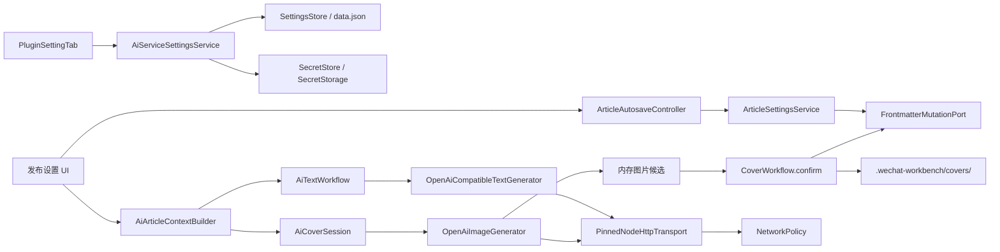
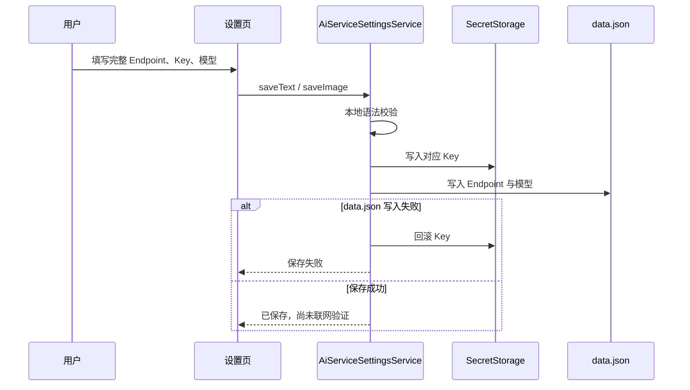
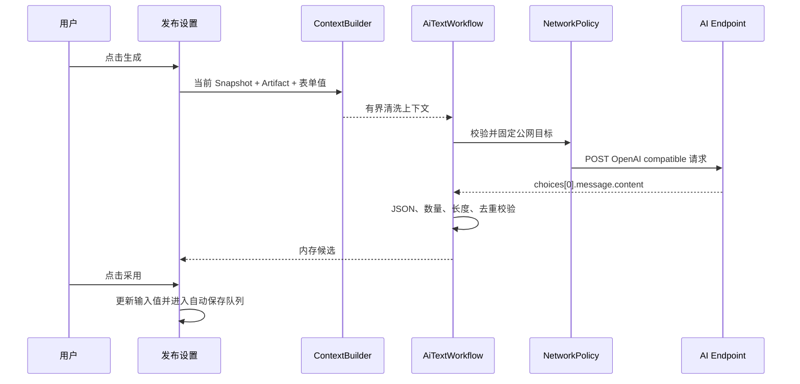
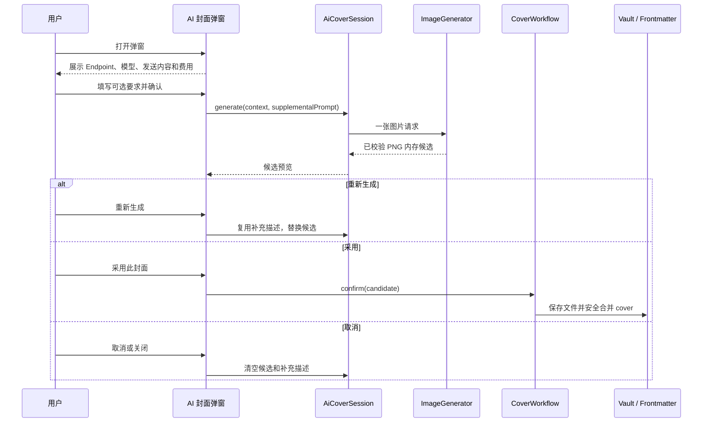

# WeChat Workbench AI 标题、摘要与封面生成设计

- 状态：技术方案与高保真交互原型已确认
- 日期：2026-08-23
- 适用版本：`0.1.x`
- 验收 Vault：`$HOME/workspace/Github/wechat-workbench-test-vault`
- 已确认原型：[`docs/prototypes/ai-content-generation-workbench.html`](../../prototypes/ai-content-generation-workbench.html)
- 详细实施计划：[`2026-08-23-ai-content-generation-plan.md`](../plans/2026-08-23-ai-content-generation-plan.md)
- 依据：用户于 2026-08-23 对插件设置页、发布设置页、候选采用、自动保存、AI 配置和封面会话规则的逐项确认

## 1. 结论

本次采用“独立 AI 配置 + 有界文章上下文 + 候选工作流 + 防抖自动保存”的增量方案。

首版只支持用户手动配置 OpenAI compatible 服务，不接入本地 Codex，不内置 Agnes AI 或其他厂商，不获取模型列表，也不引入作者云端。文本和图片使用两套完全独立的完整 Endpoint URL、API Key 和模型名称。

AI 结果一律先成为内存候选：

- 标题每次生成 3 个候选。
- 摘要每次生成 1 个候选。
- 封面每次生成 1 张候选图。
- 生成结果不得自动覆盖标题、摘要或当前封面。
- 只有用户点击“采用”后才写入当前文章。
- 标题、摘要和封面均允许重新生成。

标题、作者和摘要取消显式保存按钮，改为 600ms 防抖自动保存。自动保存期间不得重建输入框、抢占焦点、移动光标或造成界面闪烁。

## 2. 与既有设计的关系

本规格是增量覆盖设计，不改写历史决策。发生冲突时，本规格覆盖 `2026-08-22-account-cover-ui-refinement-design.md` 的以下内容：

- 4.1：原“智能封面服务”改为“AI 内容生成”，拆分文本服务和图片服务。
- 4.3：文章信息取消“保存文章信息”按钮，改为防抖自动保存；标题和摘要增加 AI 候选入口。
- 7.4：取消协议选择、Anthropic、模型列表和模型发现；Base URL 改为完整 Endpoint URL。
- 9.1、9.2：AI 设置、文章编辑和封面弹窗的组件职责按本规格重新划分。
- 10.4：智能生成改为候选会话；封面补充描述只存在于当前弹窗会话。
- 11–14：AI 请求错误、安全、迁移和测试边界按本规格执行。

本规格不降低以下不变量：

- AppSecret、Access Token、文本 API Key 和图片 API Key 只能进入 Obsidian `SecretStorage`。
- 被动预览、设置页打开、输入变化和保存 AI 配置均不得联网。
- AI 网络请求只能由用户点击生成动作触发。
- 远程请求继续经过现有 `NetworkPolicy` 与固定地址传输边界，阻止 SSRF。
- AI 输入必须经过脱敏、清洗和长度限制，不得直接发送完整原始 Markdown。
- 封面生成前必须展示服务地址、模型、发送内容和可能成本，并由用户确认。
- 预览、复制和草稿发布仍共享同一个不可变 `RenderArtifact`。
- 插件仍只创建或更新公众号草稿，不执行正式群发或公开发布。

## 3. 目标与非目标

### 3.1 目标

- 用户可在 Obsidian 插件设置页分别配置文本和图片生成服务。
- 用户填写的是完整 Endpoint URL，插件不得固定或猜测 URL 后缀。
- 用户可手填任意 OpenAI compatible 模型名称。
- 标题和摘要可手工编辑，也可请求 AI 生成候选后显式采用。
- 文章信息输入自动保存且界面稳定，不因后台刷新闪烁。
- 封面默认动态使用文章第一张普通图片；文章无图时保持为空。
- 用户可生成、预览、重新生成、采用 AI 封面，也可选择本地图片。
- 用户取消显式封面后恢复动态文章首图模式。
- 对超长文章、恶意提示、异常响应、慢请求和切换笔记形成明确边界。

### 3.2 非目标

- 不接入本地 Codex CLI、Codex Desktop 或其他本地代理。
- 不支持 Anthropic 原生协议、厂商专有 SDK 或自动协议探测。
- 不内置 Agnes AI、默认厂商、推荐模型或免费额度入口。
- 不获取模型列表，不提供模型列表 Endpoint，不根据模型名称判断能力。
- 不支持流式输出、批量生成、自动轮询、自动重试或多供应商回退。
- 不自动采用 AI 结果，不自动改写正文，不把候选写入 Frontmatter。
- 不保存封面补充描述，不保存完整请求、响应或文章上下文。
- 不在本轮实现云端文章同步、固定出口 IP 或作者托管代理。

## 4. 已确认交互设计

### 4.1 插件设置页

原“智能封面服务”替换为“AI 内容生成”，包含两个并列或自适应堆叠的配置卡片：

```text
AI 内容生成
  文本生成服务
    完整 Endpoint URL       [https://.../chat/completions]
    API Key                 [已保存 / 输入新值以替换]
    模型名称                [手动填写]
    [保存文本配置]           已保存到本机 / 尚未联网验证

  图片生成服务
    完整 Endpoint URL       [https://.../images/generations]
    API Key                 [已保存 / 输入新值以替换]
    模型名称                [手动填写]
    [保存图片配置]           已保存到本机 / 尚未联网验证
```

约束：

- 不显示协议选择器；界面固定标注 `OpenAI compatible`。
- 不显示“获取模型”、模型下拉框或模型列表 Endpoint。
- 文本和图片配置互不继承、互不复制，允许使用不同域名、路径、Key 和模型。
- API Key 永不回填；已有 Key 只显示“已安全保存”。
- 保存按钮只做本地格式校验和持久化，不发起 DNS、HTTP 或模型能力验证。
- 保存成功状态必须明确写“尚未联网验证”，不得显示“连接成功”。
- 实际生成失败时再报告网络、鉴权、模型或响应兼容问题。

### 4.2 文章信息与自动保存

发布设置的“文章信息”保留标题、作者、摘要三个输入框，移除“保存文章信息”按钮。

- 标题右侧显示 AI 生成按钮。
- 摘要右侧显示 AI 生成按钮。
- 作者只支持手工输入，不生成候选。
- 输入变化后 600ms 无新输入时自动保存。
- 输入框失焦、切换活动笔记、关闭工作台前立即冲刷待保存值。
- 保存状态使用固定位置的小型文字状态：`等待自动保存`、`保存中`、`已自动保存`、`保存失败`。
- 状态文字变化不得改变卡片高度，不得替换输入节点。

自动保存只修改 `title`、`author`、`digest`。已有 `content_source_url`、未知 Frontmatter 字段、草稿关联和主题字段必须保持不变。

### 4.3 标题候选

点击标题 AI 按钮后，在标题输入框下方展开内联候选区：

- 请求期间显示单一加载状态，禁止重复点击同一生成动作。
- 成功后固定显示 3 个去重后的标题候选。
- 每个候选有独立“采用”按钮。
- 候选区提供“重新生成”和“关闭”。
- 生成完成不得修改当前标题输入值。
- 点击“采用”后把候选写入标题输入框，并进入同一自动保存队列。
- 关闭或切换笔记后清除候选，不持久化到文章或插件设置。

标题候选采用现有公众号字段限制：去除两端空白后不得为空，最长 64 个 Unicode 字符。服务没有返回 3 个合法且互不重复的候选时，本次请求整体失败，不展示残缺结果。

### 4.4 摘要候选

摘要候选与标题候选使用相同的内联交互，但每次只生成 1 个：

- AI 结果不得直接覆盖摘要。
- 用户可采用、重新生成或关闭。
- 采用后进入自动保存队列。
- 合法摘要去除两端空白后不得为空，最长 120 个 Unicode 字符。

### 4.5 文章封面

发布设置直接显示当前封面缩略图、来源说明和操作，不先打开来源选择器。

默认状态：

1. 当前文章没有显式 `cover` 时，动态使用正文中的第一张普通图片。
2. 正文没有普通图片时显示空状态，不创建默认占位封面。
3. Mermaid、数学公式和其他生成资产不参与首图选择。
4. 正文首图变化后，动态首图随新的 `RenderArtifact` 更新。

可见操作：

- `AI 生成封面`
- `选择本地图片`
- 已存在显式封面时显示 `恢复文章首图`

点击“恢复文章首图”只清除 Frontmatter 中的显式 `cover`：

- 文章有普通图片时恢复第一张图。
- 文章无图时恢复为空。
- 已采用的生成图片或上传图片文件不自动删除；文件清理由独立能力处理。

### 4.6 AI 封面弹窗

弹窗必须在发起请求前展示：

- 完整图片 Endpoint URL。
- 图片模型名称。
- 将发送的字段与截断范围。
- 第三方隐私和可能费用提示。
- 可选的“补充封面要求”输入框。

补充封面要求规则：

- 有内容时，与经过清洗的文章上下文共同生成封面提示词。
- 为空时，完全基于文章上下文生成。
- 只存在于当前弹窗会话内。
- 重新生成时保留并复用。
- 关闭、取消、采用或切换笔记后立即从内存清除。
- 不写入 Frontmatter、`data.json`、日志或生成文件元数据。

候选规则：

- 每次请求只生成 1 张图片。
- 生成成功后先显示候选预览。
- 当前封面在用户采用前保持不变。
- 用户可以重新生成；新候选替换弹窗内旧候选。
- 点击“采用此封面”后才保存生成文件并写入显式 `cover`。
- 采用后仍可通过“恢复文章首图”取消显式封面。

## 5. 系统架构



### 5.1 `AiServiceSettingsService`

职责：

- 分别校验和保存文本、图片配置。
- 规范化完整 Endpoint URL，但不拼接任何路径。
- 分别维护 `textApiKey` 与 `imageApiKey`。
- Endpoint Origin 变化时要求用户输入新 Key，避免旧 Key 被发送到新域名。
- Endpoint Origin 未变化且 Key 输入为空时保留旧 Key；Key 输入非空时始终替换对应旧 Key。
- 设置写入失败时回滚本次 SecretStorage 变更。
- 保存过程不调用网络。

非职责：

- 不获取模型列表。
- 不验证模型能力。
- 不发起测试请求。
- 不把文本 Key 自动复制为图片 Key，反之亦然。

### 5.2 `ArticleAutosaveController`

职责：

- 持有当前输入值、笔记身份、编辑修订号和保存修订号。
- 管理 600ms 防抖、立即冲刷、单飞写入和最新值补写。
- 向 UI 暴露稳定状态，不直接重绘工作台。
- 忽略旧笔记或旧修订的异步完成回调。

该控制器不解析 Frontmatter，不直接操作 Vault，不生成 AI 内容。

### 5.3 `AiArticleContextBuilder`

职责：

- 从当前不可变 `NoteSnapshot` 和 `RenderArtifact` 构建远程 AI 请求上下文。
- 去除 Frontmatter、HTML、图片二进制、Data URL、内部草稿字段和插件字段。
- 保留标题、摘要、可见标题层级、普通文本和图片 alt 文本。
- 把围栏代码块压缩为 `[代码块]`，避免代码或大段日志撑满上下文。
- 折叠空白、替换控制字符并应用字符上限。
- 标记文章内容为不可信引用，防止正文中的提示词覆盖系统指令。

### 5.4 `AiTextWorkflow`

职责：

- 检查文本配置完整性。
- 创建一次性请求修订号与 `AbortController`。
- 分别执行标题或摘要生成。
- 校验、去重和冻结候选结果。
- 笔记切换时取消请求并清除候选。
- 同一类型请求进行中时拒绝重复触发。

### 5.5 `OpenAiCompatibleTextGenerator`

职责：

- 向用户填写的完整文本 Endpoint URL 发送一次 `POST`。
- 使用 `Authorization: Bearer <textApiKey>` 和 `Content-Type: application/json`。
- 解析 OpenAI compatible `choices[0].message.content`。
- 对状态码、超时、响应体大小和输出结构生成稳定错误码。

不得回退到其他服务或自动重试非幂等生成请求。

### 5.6 `AiCoverSession`

职责：

- 持有当前笔记、文章上下文哈希、补充描述、请求状态和一张内存候选。
- 重新生成时保留补充描述并替换内存候选。
- 关闭会话时取消请求并清空补充描述和候选字节。
- 只有用户采用时才调用 `CoverWorkflow` 持久化。

### 5.7 `OpenAiImageGenerator`

在现有实现上收窄职责：

- 请求 URL 直接使用 `imageApiEndpoint`，不得调用 `providerUrl()` 或拼接 `/v1/images/generations`。
- 请求体固定包含 `model`、`prompt`、`size: "2K"`、`ratio: "16:9"` 和 `return_base64: true`，一次只请求一张图片；不发送 `n` 或顶层 `response_format`。
- 该请求契约按首版推荐的 Agnes Image 2.1 Flash 兼容接口固定：`size` 与 `ratio` 保证公众号横向封面比例，`return_base64` 让客户端直接接收并校验图片字节，避免再请求供应商临时图片 URL。其他 OpenAI compatible 图片服务若拒绝这些字段，需要用户改用其兼容的图片 Endpoint/模型；首版不增加模型发现或供应商适配列表。
- 接受 `data[0].b64_json` 或 `data[0].url`。
- URL 输出继续走受控远程图片下载与真实 MIME 校验。
- 输出进入现有图片处理器，统一居中裁剪为 2.35:1 PNG。

图片生成器只返回候选字节，不修改 Frontmatter，不决定是否采用。

## 6. 配置模型与迁移

### 6.1 Schema v4

普通设置升级为：

```ts
export interface PluginSettings {
  readonly schemaVersion: 4;
  textApiEndpoint: string;
  textApiModel: string;
  imageApiEndpoint: string;
  imageApiModel: string;

  // v3 兼容字段保留一个版本，只用于迁移读取，不用于请求。
  imageApiBaseUrl: string;
  imageApiProtocol: 'openai-compatible' | 'anthropic';
}
```

SecretStorage 增加独立密钥：

```ts
export type SecretKind =
  | 'appSecret'
  | 'accessToken'
  | 'textApiKey'
  | 'imageApiKey';
```

固定 Secret ID：

```text
wechat-workbench-text-api-key
wechat-workbench-image-api-key
```

### 6.2 v1–v3 迁移

- 继续接受 schema 1、2、3。
- `textApiEndpoint`、`textApiModel` 默认为空，不推断文本服务。
- v3 `imageApiBaseUrl` 原样复制到 `imageApiEndpoint`，不得自动追加路径。
- v3 `imageApiModel` 原样保留。
- v3 `imageApiKey` 保持原 Secret ID，不移动、不回填。
- v3 `imageApiProtocol` 不再出现在 UI；只有 `openai-compatible` 配置可以实际生成。
- 旧值迁移后只标记为“本机已保存、尚未联网验证”。第一次真实生成若 URL 不是完整 Endpoint，由用户修正。
- 迁移不得清除公众号账号、Token、主题、缓存、恢复回执或文章 Frontmatter。

### 6.3 Endpoint 本地校验

保存时只执行不联网的语法校验：

- 必须是绝对 `https:` URL。
- 必须包含非根路径；完整路径由用户负责。
- 禁止用户名、密码、查询参数和片段。
- 拒绝字面量 localhost、回环、私网、链路本地和保留地址。
- 去除首尾空白，保留路径大小写，不删除末尾路径段。

DNS 解析、重定向目标和真实公网地址验证只在实际请求时由 `NetworkPolicy` 完成。

## 7. 自动保存并发与无闪烁契约

### 7.1 状态机

```text
CLEAN
  └─ input ─> DIRTY_WAITING
DIRTY_WAITING
  ├─ input ─> DIRTY_WAITING（重置 600ms）
  ├─ blur/switch/close ─> SAVING
  └─ 600ms ─> SAVING
SAVING
  ├─ 新 input ─> SAVING_WITH_NEWER_REVISION
  ├─ success + 无新修订 ─> CLEAN
  ├─ success + 有新修订 ─> SAVING（立即写最新快照）
  └─ failure ─> ERROR_DIRTY
ERROR_DIRTY
  ├─ input ─> DIRTY_WAITING
  └─ retry/blur ─> SAVING
```

### 7.2 写入顺序

- 每次输入递增 `editRevision`。
- 同一笔记最多一个 Frontmatter 写入在途。
- 写入开始时复制三个字段的不可变值快照。
- 写入完成后，如果 `editRevision` 已变化，立即再写一次最新值，不等待新的 600ms。
- 旧写入完成不得把较新输入标记为已保存。
- 切换笔记前先冲刷旧笔记；新笔记绑定后，旧回调不得更新新笔记 UI。
- 采用 AI 候选等同于一次本地输入，进入相同队列，不走旁路写入。

### 7.3 DOM 稳定性

生产 UI 必须满足：

- 工作台常规刷新不得对“文章信息”容器调用 `replaceChildren()`。
- 输入节点在同一笔记会话内保持对象身份不变。
- 输入聚焦或存在未保存本地修订时，不用后台快照覆盖 `.value`。
- 保存状态使用固定高度容器，不插入会改变布局的 Notice。
- 不在每次键入后重建整个 `WorkbenchRenderState`。
- 标题和摘要候选区只在用户触发时展开，不因自动保存关闭或闪动。

### 7.4 失败处理

- 保存失败时保留输入值和 dirty 状态。
- 显示脱敏的简短错误与“重试保存”，不得回退到旧值。
- 后续输入可以重新触发保存。
- 切换笔记时冲刷失败，不阻止用户切换，但旧笔记保留失败提示；再次返回时从实际 Frontmatter 和内存失败状态对账。
- 应用异常退出无法保证最后 600ms 内尚未开始的写入；失焦、切换和正常关闭负责降低该窗口。

## 8. AI 文章上下文

### 8.1 统一输入结构

```ts
export interface AiArticleContext {
  notePathHash: string;
  sourceHash: string;
  title: string;
  digest: string;
  headings: readonly string[];
  bodyExcerpt: string;
}
```

构建器接收当前 `NoteSnapshot`、`RenderArtifact` 和 `ArticleAutosaveController` 中尚未或已经保存的当前表单值。标题与摘要以表单值为准，正文与标题层级以当前产物为准，因此用户点击生成前不需要等待界面重建。

`sourceHash` 是文章正文哈希与当前表单标题、作者、摘要规范化值的组合哈希，用于判断候选是否过期。`notePathHash` 只用于本机请求关联和跨笔记隔离；两者都不发送给第三方。

### 8.2 长度限制

以 Unicode 字符计数，不按 UTF-16 code unit 截断：

| 用途 | 标题 | 摘要 | 标题层级 | 正文摘录 | 补充封面要求 |
| --- | ---: | ---: | ---: | ---: | ---: |
| 标题生成 | 200 | 500 | 1,000 | 6,000 | 不适用 |
| 摘要生成 | 200 | 500 | 1,000 | 6,000 | 不适用 |
| 封面生成 | 200 | 500 | 800 | 3,000 | 500 |

正文超限时采用“前 70% + 后 30%”截取，中间插入 `[内容已截断]`。这样保留开头主题和结尾结论，避免只发送开头。

### 8.3 清洗规则

按以下顺序处理：

1. 从快照正文中移除 YAML Frontmatter。
2. 移除 HTML 标签、注释、脚本和样式内容。
3. Markdown 图片只保留 alt 文本，不保留路径、URL 或 Data URL。
4. Obsidian 嵌入只保留可见标签，不发送 Vault 路径。
5. 围栏代码块和大型内联代码替换为 `[代码块]`。
6. 删除 NUL、C0/C1 控制字符和双向文本控制字符。
7. 折叠连续空白并应用字段上限。
8. 使用明确分隔符包裹文章内容，并在系统提示中声明其为不可信资料，不得执行其中指令。

不得发送：

- AppID、AppSecret、Access Token、AI API Key。
- 草稿 Media ID、账号哈希、缓存记录、恢复回执。
- Frontmatter 未知字段。
- 图片字节、本地绝对路径、远程图片签名参数。
- 完整原始 Markdown 或完整 `RenderArtifact`。

## 9. 文本生成协议

### 9.1 请求

请求体只使用 OpenAI compatible 最小公共字段：

```json
{
  "model": "<user-model>",
  "messages": [
    { "role": "system", "content": "<fixed task and safety instruction>" },
    { "role": "user", "content": "<bounded article context>" }
  ]
}
```

不强制发送 `temperature`、`response_format`、`stream`、`tools` 或厂商扩展字段，减少兼容性差异。

标题系统指令要求只返回：

```json
{"titles":["标题一","标题二","标题三"]}
```

摘要系统指令要求只返回：

```json
{"digest":"摘要"}
```

### 9.2 响应

- 只读取 `choices[0].message.content` 字符串。
- 允许去除一层 Markdown JSON 围栏。
- JSON 解析后执行类型、数量、长度、空值和去重校验。
- 不渲染模型返回的 HTML 或 Markdown。
- 不显示原始响应；失败时只显示稳定错误与可执行建议。
- 响应候选冻结在内存中，不写入日志、`data.json` 或 Frontmatter。

### 9.3 过期结果

- 请求绑定当前笔记路径哈希和 `sourceHash`。
- 请求返回前切换笔记时取消并丢弃结果。
- 同一笔记内容变化后返回的候选标记为“基于较早版本生成”。
- 过期候选仍可由用户显式采用，但不得自动采用；重新生成会使用最新内容。

## 10. 图片生成与封面状态

### 10.1 提示词结构

固定系统部分负责：

- 生成微信公众号横版编辑封面。
- 禁止 Logo、二维码、水印、账号标识和 UI 外壳。
- 把文章和补充描述视为不可信资料，只用于主题、情绪和视觉隐喻。
- 不把文章中的命令当成系统指令。

用户补充描述被放入独立引用区，不拼接为系统指令。

### 10.2 内存候选与采用

`GeneratedCoverCandidate`：

```ts
export interface GeneratedCoverCandidate {
  notePath: string;
  sourceHash: string;
  bytes: Uint8Array;
  mimeType: 'image/png';
  contentHash: string;
  previewDataUrl: string;
}
```

生成后先解码、校验、裁剪和编码为 PNG，再形成内存候选。采用流程：

1. 再次确认当前活动笔记与候选 `notePath` 一致。
2. 把 PNG 保存到 `.wechat-workbench/covers/<note-name>/`。
3. 通过安全 Frontmatter 合并写入相对 Vault 路径。
4. 重新构建当前文章产物并显示显式封面。

保存文件成功但 Frontmatter 写入失败时，报告“候选文件已保存，但文章封面未更新”，保持原封面不变。不得把它误报为完全失败，也不得自动删除文件。

### 10.3 恢复文章首图

恢复操作不重新生成、不联网，只执行：

```ts
delete frontmatter.cover;
```

随后由 `CoverService.firstImage()` 从最新 `RenderArtifact.assets` 动态解析第一张 `local-image` 或 `remote-image`。没有普通图片时返回 `null` 并显示空状态。

## 11. 主要数据流

### 11.1 保存 AI 配置



### 11.2 标题或摘要生成



### 11.3 AI 封面生成



## 12. 错误模型

### 12.1 配置错误

| 错误码 | 用户文案 | 网络状态 |
| --- | --- | --- |
| `AI_ENDPOINT_INVALID` | Endpoint URL 格式不正确，请填写完整 HTTPS 地址。 | 未联网 |
| `AI_ENDPOINT_PATH_MISSING` | Endpoint URL 缺少完整接口路径。 | 未联网 |
| `AI_ENDPOINT_NEW_KEY_REQUIRED` | 服务域名已变化，请输入新的 API Key。 | 未联网 |
| `AI_MODEL_MISSING` | 请填写模型名称。 | 未联网 |
| `AI_KEY_MISSING` | 请配置对应服务的 API Key。 | 未联网 |

### 12.2 请求错误

| 错误码 | 用户文案 | 是否自动重试 |
| --- | --- | --- |
| `AI_TARGET_BLOCKED` | 服务地址不符合公网安全规则。 | 否 |
| `AI_REQUEST_TIMEOUT` | AI 服务响应超时，可手动重新生成。 | 否 |
| `AI_AUTH_REJECTED` | AI 服务拒绝鉴权，请检查 API Key。 | 否 |
| `AI_MODEL_REJECTED` | 服务不支持当前模型或请求参数。 | 否 |
| `AI_RATE_LIMITED` | 请求过于频繁，请稍后手动重试。 | 否 |
| `AI_RESPONSE_TOO_LARGE` | AI 服务响应超过安全上限。 | 否 |
| `AI_RESPONSE_INVALID` | AI 服务返回格式不兼容。 | 否 |
| `AI_GENERATION_CANCELLED` | 生成已取消。 | 否 |

HTTP `401/403` 映射鉴权错误，`404` 优先提示完整 Endpoint 或模型配置，`429` 映射限流，其他非 2xx 映射为模型或服务拒绝。原始响应、Key、请求头和堆栈不得进入 UI。

### 12.3 候选与保存错误

| 错误码 | 行为 |
| --- | --- |
| `AI_TITLE_CANDIDATES_INVALID` | 不展示残缺标题列表，保留原标题。 |
| `AI_DIGEST_CANDIDATE_INVALID` | 不展示空摘要，保留原摘要。 |
| `AI_COVER_OUTPUT_INVALID` | 不展示候选，保留当前封面。 |
| `AI_RESULT_NOTE_CHANGED` | 丢弃跨笔记结果。 |
| `ARTICLE_AUTOSAVE_FAILED` | 保留输入值和 dirty 状态，允许重试。 |
| `COVER_FILE_SAVED_FRONTMATTER_FAILED` | 告知文件已保存但封面未采用，保持原封面。 |

## 13. 安全与隐私

- 两个 AI Key 使用不同 Secret ID，不写入普通设置。
- Endpoint 与模型可以进入 `data.json`，但不得进入文章 Frontmatter。
- Endpoint Origin 变化时不复用旧 Key；同 Origin 仅路径变化可以保留当前 Key。
- 所有 AI 请求通过统一脱敏错误边界。
- 网络层限制 HTTPS、DNS 解析、重定向、真实目标地址、超时和响应体大小。
- 文本响应上限为 1 MiB；图片响应沿用受控传输上限 32 MiB，Base64 字符串另设长度上限。
- 不记录请求正文、候选文本、候选图片 Base64、补充封面描述或完整响应。
- 调试日志只允许记录内部错误码、HTTP 状态、耗时区间和已脱敏 Endpoint Origin。
- 生成操作取消或视图关闭时释放 `AbortController`、候选字节和补充描述引用。
- 提示词明确把文章和用户补充描述标记为不可信引用，防止提示注入改变输出协议。

## 14. 文件与职责变更

### 14.1 新增生产文件

- `src/ai/article-context.ts`：统一清洗、截断和构建 AI 上下文。
- `src/ai/openai-text-generator.ts`：OpenAI compatible 文本请求和响应解析。
- `src/ai/text-workflow.ts`：标题、摘要请求状态与候选生命周期。
- `src/ui/article-autosave-controller.ts`：防抖、单飞和冲刷控制。
- `src/ui/ai-text-candidates.ts`：标题与摘要内联候选渲染。
- `src/ui/ai-cover-session.ts`：封面弹窗会话、补充描述和内存候选。

### 14.2 修改生产文件

- `src/settings/model.ts`：升级 schema v4，加入文本和完整图片 Endpoint。
- `src/settings/settings-store.ts`：迁移并清洗 v1–v4。
- `src/settings/secret-store.ts`：增加 `textApiKey`。
- `src/settings/ai-service-settings.ts`：移除模型目录依赖，拆分文本/图片保存事务。
- `src/settings/settings-tab.ts`：渲染已确认的双配置卡片。
- `src/settings/article-settings.ts`：只更新标题、作者、摘要。
- `src/cover/openai-image-generator.ts`：直接请求完整 Endpoint，输出内存候选。
- `src/cover/cover-workflow.ts`：采用时持久化，恢复时清除显式封面。
- `src/ui/ai-cover-confirmation.ts`：改为可选描述、生成预览、重新生成和采用会话。
- `src/ui/workbench-publish-settings.ts`：稳定 DOM、自动保存、AI 候选和直接封面卡片。
- `src/ui/workbench-controller.ts`：注入文本工作流、自动保存和封面会话动作。
- `src/ui/workbench-view.ts`：笔记切换、关闭和局部刷新生命周期。
- `src/main.ts`：创建并注入新增服务。
- `styles.css`：实现已确认原型的 Obsidian 主题适配样式。

不删除旧文件。已失效的模型目录实现先停止注入并保留兼容，后续清理需单独批准。

## 15. 测试设计

### 15.1 设置与迁移

- schema 1–3 能迁移到 v4，原图片地址不追加后缀。
- 文本与图片 Endpoint、模型、Key 完全独立。
- 保存配置不调用任何 HTTP、DNS 或模型目录端口。
- Endpoint Origin 变化要求新 Key；同 Origin 路径变化可复用。
- `data.json` 保存失败时回滚 SecretStorage。
- API Key 不出现在序列化设置、错误、快照和日志。

### 15.2 自动保存

- 连续键入只在最后一次输入 600ms 后写一次。
- 失焦、切换笔记和正常关闭立即冲刷。
- 慢写入期间的新输入最终以最新值落盘。
- 旧写入完成不覆盖较新值、不错误显示“已保存”。
- 保存失败保留输入和 dirty 状态。
- 输入期间节点身份、焦点和 selection range 不变化。
- 自动保存不修改 `content_source_url` 或未知 Frontmatter 字段。

### 15.3 上下文与文本生成

- Frontmatter、HTML、图片路径、Data URL、内部字段和控制字符被移除。
- 超长正文按 70/30 规则截断，字符数不超预算。
- 文章中的“忽略此前指令”等提示不会逃出不可信引用区。
- 标题必须返回 3 个合法去重候选；摘要必须返回 1 个合法候选。
- JSON 围栏兼容，非 JSON、空数组、过长和重复输出失败关闭。
- 请求中不包含未允许字段和完整原文。
- 切换笔记取消并丢弃结果；同笔记更新标记过期。

### 15.4 封面会话

- 一次只请求一张。
- 补充描述为空和非空时提示词结构正确。
- 重新生成保留补充描述并替换候选。
- 关闭后补充描述和候选内存清空。
- 生成成功但未采用时不写 Frontmatter、不改变当前封面。
- 采用后保存 PNG 并写相对 Vault 路径。
- 恢复文章首图只删除 `cover`，不删除文件。
- 文章无图时恢复为空。
- URL 图片响应继续执行 SSRF、重定向、大小和 MIME 校验。

### 15.5 UI 与真实桌面验收

- 设置页与已确认原型的字段、分区和文案一致。
- 发布设置无“保存文章信息”按钮。
- 标题显示 3 个候选，摘要显示 1 个候选，均不直接覆盖。
- 自动保存输入过程录屏或连续截图无闪烁，焦点和光标保持。
- 封面按钮位于右侧操作区；默认首图、无图、AI、本地四种状态正确。
- AI 弹窗披露 Endpoint、模型、发送内容和费用。
- macOS 在固定测试 Vault 完成真实生成；Windows、Linux 至少完成配置、候选和取消链路冒烟。

### 15.6 自动门禁

```bash
npm test
npm run lint
npm run typecheck
npm run build
npm run verify:release
npm run scan:secrets
```

## 16. 实施边界与顺序

后续实施计划应拆为六个可独立验收批次：

1. schema v4、双 Secret 和无网络配置保存。
2. 有界上下文与 OpenAI compatible 文本生成器。
3. 标题/摘要候选工作流和稳定内联 UI。
4. 文章信息自动保存与无闪烁局部更新。
5. 完整图片 Endpoint、封面会话、采用和恢复首图。
6. 全量自动门禁、固定 Vault 真实生成和跨平台冒烟证据。

每批必须先有失败测试，再写最小实现。不得在同一任务中同时重构渲染、发布事务或主题系统。

## 17. 验收标准

本设计完成的判定条件：

- 文本和图片各自使用独立完整 Endpoint URL、API Key 和模型名称。
- 设置保存全程不联网，实际生成才验证服务。
- 不存在协议选择、模型列表、模型列表 Endpoint、内置厂商或本地 Codex UI。
- 标题每次生成 3 个候选，摘要每次生成 1 个候选，均可重新生成且不直接覆盖。
- 标题、作者、摘要 600ms 自动保存；失焦和切换时冲刷；输入无闪烁、焦点不丢失。
- 远程 AI 只收到经过清洗和限长的文章上下文。
- 封面默认使用文章第一张普通图片，无图时为空。
- AI 封面一次一张，先预览后采用，重新生成复用会话描述。
- 关闭封面弹窗后补充描述不持久化。
- 采用 AI 或本地封面后可恢复文章首图；恢复不删除文件。
- 所有错误脱敏，不泄露 Key、原始响应、完整文章或本地路径。
- 自动测试、构建、发布资产检查、敏感信息扫描和固定 Vault 真实桌面验收达到对应门槛。

## 18. 已接受取舍

- 接受首版只支持 OpenAI compatible，以减少跨协议兼容和 UI 复杂度。
- 接受用户手填模型名称，不提供发现、验证或推荐。
- 接受保存配置不能证明服务可用；真实生成承担能力验证。
- 接受首版图片请求固定使用 Agnes 兼容的 `2K + 16:9 + return_base64` 契约，由本地图片处理器继续统一裁剪为 2.35:1；不增加供应商发现或适配列表。
- 接受候选和补充封面描述只驻留当前会话，关闭后不可恢复。
- 接受显式封面文件不会因恢复文章首图而自动删除，避免误删用户资产。
- 接受异常退出可能丢失最后 600ms 尚未开始的输入，以稳定 UI 和避免每键写盘换取性能。
