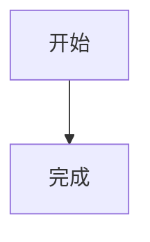

# 样式工作台验证

这是一段用于验证公众号排版的合成文章。

## 层级标题

### 小节

#### 细节

##### 注释

###### 尾注

**加粗**、*斜体*、`inline code` 和 [链接](https://example.test/article)。

> 一段引用文字，用于观察边框和留白。

> [!NOTE] 提示
> 这是一条 Obsidian callout。

1. 有序列表
2. 第二项

- 无序列表
- 第二项

```ts
const answer = 42;
return answer;
```

| 模块 | 状态 |
| --- | --- |
| Markdown | 正常 |
| 主题 | 正常 |

---


行内公式 $E = mc^2$。


